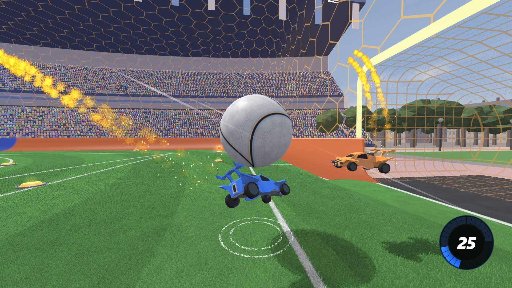
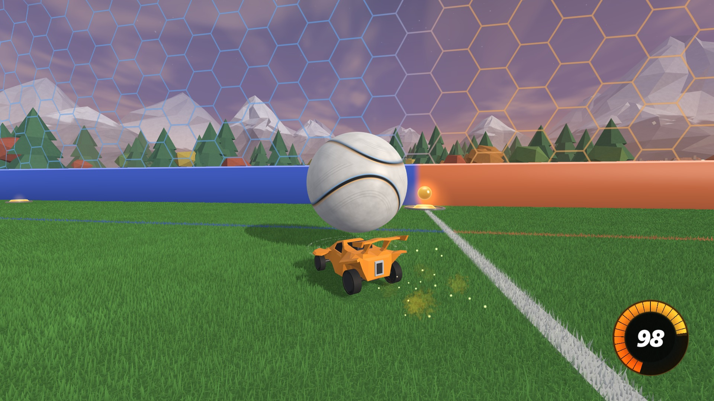
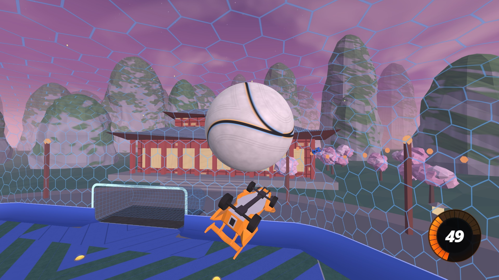
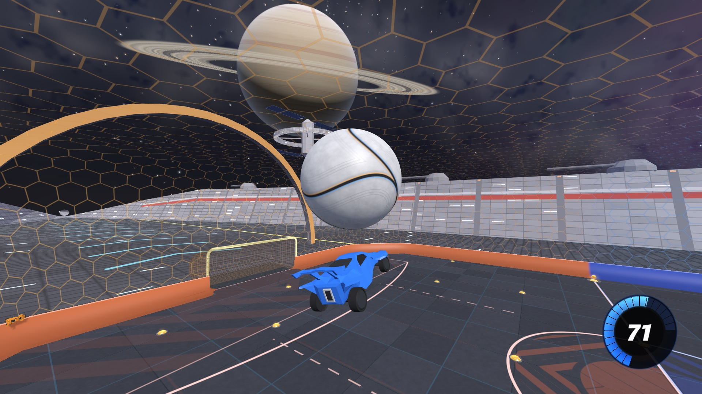

# BeautifulSim

A Rocket League-style 3D visualizer for bots trained with [RocketSim](https://github.com/ZealanL/RocketSim)
(GigaLearnCPP, rlgym-sim / RLGym-PPO, or anything that can send JSON over UDP).

It's a fork of [RocketSimVis](https://github.com/ZealanL/RocketSimVis) by ZealanL with reworked visuals: your
training (or any other program) streams game states to it, and it renders them live in a stylized arena with
effects, a Rocket League-like camera, and a clip recorder. It never touches the simulation, it only watches.

This version ships **without any sound files or Rocket League game files**: every model and texture comes
from RocketSimVis or is generated procedurally. The sound system is all there, though: drop your own sound
files into `data/sounds/` and they play (see [Sound](#sound)).

<p align="center"></p>
<p align="center">
  
  
  
  
</p>
<p align="center"><sub>A real bot game (1v1), one map per shot: Parc de Paris, Evening Valley, Forbidden Temple and
Orbit. High preset, 1920x1080, rendered with <code>tools/readme_shots.py</code>.</sub></p>

## Installation (Windows)

1. Install **Python 3.10+** and **git**.
2. Clone the repo and install the dependencies:
   ```bat
   git clone https://github.com/Nashh2678/BeautifulSim-NoAudio.git
   cd BeautifulSim-NoAudio
   pip install -r requirements.txt
   ```
3. Launch it: double-click **`RUN.bat`**, or run `python src\main.py` to see errors in a console.
   The first start takes a few extra seconds (the landscape mesh is generated once and cached).
4. Optional, for clips: install ffmpeg (`winget install Gyan.FFmpeg`) or point `RSV_FFMPEG` at an `ffmpeg.exe`.

## Sending it a game

The vis listens on **UDP 127.0.0.1:9273** and renders whatever game states it receives (an empty arena until then):

- **GigaLearnCPP**: use its render mode (the `RenderSender` + `python_scripts/render_receiver.py` pair sends to this port).
- **rlgym_sim / RLGym-PPO**: copy `rocketsimvis_rlgym_sim_client.py` next to your training script, then right after `env = rlgym_sim.make(...)`:
  ```py
  import rocketsimvis_rlgym_sim_client as rsv
  type(env).render = lambda self: rsv.send_state_to_rocketsimvis(self._prev_state)
  ```
- **Anything else**: send JSON in the format described in [networking-format.md](networking-format.md).
  The optional per-car fields (`has_flip`, `ball_touched`, `controls`) make jumps, flips, flip resets and touches exact;
  without them they are guessed from the motion.

Run several instances side by side with `RSV_PORT=<port>`.

## Controls

| key | action |
|---|---|
| Space | ball cam on/off |
| P | spectate the player closest to the ball |
| A | auto camera on/off (follows whoever is closest to the ball) |
| `&` `é` `"` (or 1 2 3) | ask the sender to show 1v1 / 2v2 / 3v3 (it switches only if its bot's observation supports that team size) |
| S / D | ask the sender for stochastic / deterministic bot actions |
| C | save a clip of the last 12 s (mp4, in `clips/`; a top-left indicator shows the render progress) |
| M | mute (when sound files are installed) |
| `[` / `]` | volume down / up |
| H | show/hide the top-left panel (Edit Settings: camera, audio, graphics) |
| ← ↑ → ↓ | map: ← Forbidden Temple, ↑ Evening Valley, → Parc de Paris, ↓ Orbit (remembered for the next start) |

The 1/2/3 and S/D keys are requests sent to whatever is streaming the game (a small UDP side channel, see
[networking-format.md](networking-format.md)). A sender that doesn't handle them keeps working; the visualizer
just says nobody answered.

## Settings

H opens the top-left panel; **Edit Settings** has three groups. Everything applies live and is remembered
(`src/rsv_settings.json`).

- **Camera**: field of view, distance, height, angle, stiffness and ball-cam transition speed, with the same names,
  ranges and meaning as Rocket League's own camera settings, so you can copy yours over.
- **Audio**: master volume and a slider per sound category (only shown when sound files are installed).
- **Graphics**:
  - **Quality preset**: **Low**, **Medium** or **High** sets every visual-quality slider and the anti-aliasing at once.
    Changing any one of them afterwards switches the preset to **Custom**.
  - **Visual quality** sliders (Low / Medium / High): **shadow quality** (resolution and softness of the car and ball
    shadows), **crowd** (how many fans fill the stands), **map detail** (how much of the scenery is drawn; Low and
    Medium also use a pre-rendered sky), **grass** (Off / Low / Medium / High: 3D grass blades near the camera),
    **particles** (how many sparks, smoke puffs and debris effects spawn) and **render resolution** (70 / 85 / 100%
    of the window's resolution for the 3D scene; the HUD always stays sharp).
  - **Toggles**: shadows, ball trail, ball circles (the marker on the ground under the ball).
  - **Anti-aliasing**: MSAA off / 2x / 4x / 8x.
  - **Resolution**: Balanced (the 3D scene is capped at 2.1 MP, about 1080p, and upscaled: cheap on big screens),
    Native (full window resolution: pick it on a 1440p/4K screen if Balanced looks soft), or Supersampled 1.5x / 2x.
  - **Distant detail** (Smooth, or Sharp at the cost of some shimmer), **VSync**, and a **frame-rate cap**
    (monitor refresh, 60, 120, 144, 240 or unlimited).

## Performance

- **High** (everything maxed, 8x MSAA) stays **above 60 fps at 1080p even on an integrated Radeon 780M**: about
  8 ms of GPU time per frame on Parc de Paris, the heaviest map, and never more than 12.4 ms (60 fps = 16.7 ms), with
  a training run using the same machine.
- **Low** is made for integrated GPUs on high-refresh screens; **Medium** sits in between.
- On a discrete GPU, High runs at high refresh rates; there the limit is the CPU (the renderer is Python).
- It shares the GPU with whatever else runs: `RSV_FPS=<n>` caps its frame rate if you want to leave more of it to
  training.

## Sound

No sound files are included. `data/sounds/manifest.json` links every game event (jumps, flips, flip resets,
ball hits by distance, bounces, bumps, demos, boost, goals, pad pickups...) to file names: put `.ogg`/`.wav`
files with those names in `data/sounds/` and they're used at the next start, positioned in 3D around the
camera. Any subset works (missing events stay silent), and the engine sound is synthesised from 10 loops
in `data/sounds/engine_src/`. The full list is in [data/sounds/README.md](data/sounds/README.md). Sound files
there are git-ignored, so they never get committed by accident.

## Features

- **Maps** (arrow keys, remembered): the evening valley below (with a lakeside village, a castle, a windmill and
  hot-air balloons); a Forbidden Temple-style pink dusk with karst
  peaks, pagodas, a paifang gate, cherry trees and lanterns; a Parc de Paris-style noon with two curved blue / orange stands under
  sweeping floodlit roofs, a formal garden with a golden-sphere fountain and graffiti, and the Eiffel Tower
  down the Champ de Mars; and a star cruiser in orbit, the arena on its flight deck between armoured hull
  flanks (stars of many shades, the Milky Way,
  a ringed gas giant, a moon, the planet below, an asteroid belt, a station; no crowd). Each has its own
  sky, light and field style, and a crowd of eggs: about 30% of the fans are always cheering; after a save both
  teams' fans jump on their seats, after a goal only the scoring team's (in Paris each stand is one team's). A save =
  a defender's touch on a ball that was going in.
- **Arena**: see-through hexagon walls and ceiling, a pitch with 3D grass and Rocket League-style team markings
  (striped zones in front of each goal, split centre circle, team lanes), smooth team-coloured floor-to-wall curves,
  translucent team nets, and real-time soft shadows of the cars and the ball, cast from each map's sun.
- **Cars and ball**: team-painted cars, a two-seam ball that darkens as it crosses the goal line, shiny boost pads
  that stay black, then whiten from the edge in as they recharge, with the orb coming back as a blurry ghost that
  sharpens into gold just before it respawns, and Rocket League's white ball marker on the ground under the ball
  (an outer ring the size of the ball and an inner ring of 4 arcs that shrinks to 4 dots as the ball rises).
- **Ball trail**: like Rocket League, a real 3D tube in the colour of the last team to touch the ball, shown above
  82 kph, white right behind the ball, soft at the edges and fading out over 1 s.
- **Effects**:
  - **Boost**: Alpha Boost-style, two streams of golden flame puffs that appear a little behind the car and grow,
    with small sparkles.
  - **Supersonic**: a thin glowing violet trail from each rear wheel, plus speed lines.
  - **Goals**: an explosion in the scoring team's colour (a white-hot flash, shock spheres, a ground ring and a
    plasma cloud bursting out of the goal), and golden "BLUE SCORED!" / "ORANGE SCORED!" text.
  - **Hits and moves**: jump and flip flashes, sparks where a car's body (not its wheels) hits the ball, the arena
    or another car, faint streaks from the car's corners while it flips, demolition explosions.
  - **Pickups and flip resets**: soft 3D glow domes on boost pad pickups, a boost gauge, and a Rocket League-style
    flip-reset indicator (a white disc under the car's wheels, as long as the car, for 120 ms).
- **Game events** reconstructed from the state stream: jumps, double jumps, flips (including wall dashes),
  flip resets (only when the reset is really taken on the ball), ball touches, bounces (floor, walls, posts
  and crossbar), car body impacts, bumps, demos and goals.
- **Smooth playback**: incoming states go through an adaptive jitter buffer (it deepens after a hiccup, up to
  150 ms, and relaxes over ~45 s), so uneven packet timing from a busy trainer doesn't freeze the ball.
- **Clips**: C saves the last 12 s by re-rendering them offscreen at 1080p60 (hardware-encoded with NVIDIA NVENC or AMD AMF when available, else on the CPU),
  so recording never slows the live view; installed sounds are mixed in. A top-left indicator shows
  "Clipping..." with a progress bar, then "Clip saved!".

## Developer tools

All in `tools/`, all headless (no window):

- `fx_gallery.py --out <dir> [--only goal,boostdrive] [--map paris]`: close-up contact sheets of every effect.
- `headless_test.py --out <dir>`: a scripted 2v2 scene with screenshots, per-frame timing and the event log.
- `readme_shots.py <recording> --map paris --every 0.5` (or `--at 3.0,27.0`): stills of a recorded game at the High
  preset, like the screenshots above. Recordings come from the clip recorder: start the vis with
  `RSV_CLIP_KEEP_REPLAY=1` and press C; the replay is kept in `clips/` next to the mp4.
- `gpu_contention_bench.py`: how much the vis slows down a CUDA training workload (needs PyTorch).

## Credits

- [ZealanL](https://github.com/ZealanL): [RocketSimVis](https://github.com/ZealanL/RocketSimVis), the visualizer this is built on,
  and [RocketSim](https://github.com/ZealanL/RocketSim). The car, arena and boost pad models are his, used under his
  terms: free to use for anything as long as he is credited. If you reuse them, credit him too.
- Rocket League is a trademark of Psyonix. This project is not affiliated with or endorsed by Psyonix or Epic Games.
