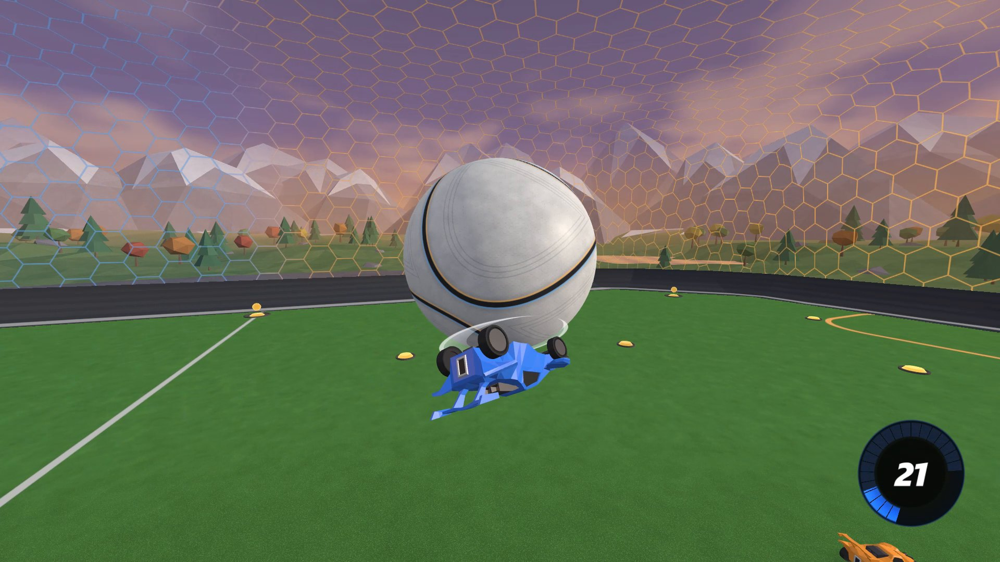

# BeautifulSim

A Rocket League-style 3D visualizer for bots trained with [RocketSim](https://github.com/ZealanL/RocketSim)
(GigaLearnCPP, rlgym-sim / RLGym-PPO, or anything that can send JSON over UDP).

It's a fork of [RocketSimVis](https://github.com/ZealanL/RocketSimVis) by ZealanL with reworked visuals: your
training (or any other program) streams game states to it, and it renders them live in a stylized arena with
effects, a Rocket League-like camera, and a clip recorder. It never touches the simulation, it only watches.

This version ships **without any sound files or Rocket League game files**: every model and texture comes
from RocketSimVis or is generated procedurally. The sound system is all there, though: drop your own sound
files into `data/sounds/` and they play (see [Sound](#sound)).

<p align="center"></p>
<p align="center">
  
  
  
  
</p>

## Installation (Windows)

1. Install **Python 3.10+** and **git**.
2. Clone the repo and install the dependencies:
   ```bat
   git clone https://github.com/Nashh2678/BeautifulSim-NoAudio.git
   cd BeautifulSim-NoAudio
   pip install -r requirements.txt
   ```
3. Launch it: double-click **`RUN.bat`**, or run `python src\main.py` to see errors in a console.
   The first start takes a few extra seconds (the landscape mesh is generated once and cached).
4. Optional, for clips: install ffmpeg (`winget install Gyan.FFmpeg`) or point `RSV_FFMPEG` at an `ffmpeg.exe`.

## Sending it a game

The vis listens on **UDP 127.0.0.1:9273** and renders whatever game states it receives (an empty arena until then):

- **GigaLearnCPP**: use its render mode (the `RenderSender` + `python_scripts/render_receiver.py` pair sends to this port).
- **rlgym_sim / RLGym-PPO**: copy `rocketsimvis_rlgym_sim_client.py` next to your training script, then right after `env = rlgym_sim.make(...)`:
  ```py
  import rocketsimvis_rlgym_sim_client as rsv
  type(env).render = lambda self: rsv.send_state_to_rocketsimvis(self._prev_state)
  ```
- **Anything else**: send JSON in the format described in [networking-format.md](networking-format.md).
  The optional per-car fields (`has_flip`, `ball_touched`, `controls`) make jumps, flips, flip resets and touches exact;
  without them they are guessed from the motion.

Run several instances side by side with `RSV_PORT=<port>`.

## Controls

| key | action |
|---|---|
| Space | ball cam on/off |
| P | spectate the player closest to the ball |
| A | auto camera on/off (follows whoever is closest to the ball) |
| `&` `é` `"` (or 1 2 3) | ask the sender to show 1v1 / 2v2 / 3v3 (it switches only if its bot's observation supports that team size) |
| S / D | ask the sender for stochastic / deterministic bot actions |
| C | save a clip of the last 12 s (mp4, in `clips/`; a top-left indicator shows the render progress) |
| M | mute (when sound files are installed) |
| `[` / `]` | volume down / up |
| H | show/hide the top-left panel (Edit Settings: camera, audio, graphics) |

**Graphics** (H → Edit Settings → Graphics, applied live): anti-aliasing (MSAA off/2x/4x/8x), resolution
(Balanced caps the 3D scene at 2.1 MP and upscales it: pick Native on a 1440p/4K screen if it looks soft, or
Supersampled for extra smoothness), distant detail, VSync, frame-rate cap. Camera settings mirror Rocket League's.

The 1/2/3 and S/D keys are requests sent to whatever is streaming the game (a small UDP side channel, see
[networking-format.md](networking-format.md)). A sender that doesn't handle them keeps working; the visualizer
just says nobody answered.

## Sound

No sound files are included. `data/sounds/manifest.json` links every game event (jumps, flips, flip resets,
ball hits by distance, bounces, bumps, demos, boost, goals, pad pickups...) to file names: put `.ogg`/`.wav`
files with those names in `data/sounds/` and they're used at the next start, positioned in 3D around the
camera. Any subset works (missing events stay silent), and the engine sound is synthesised from 10 loops
in `data/sounds/engine_src/`. The full list is in [data/sounds/README.md](data/sounds/README.md). Sound files
there are git-ignored, so they never get committed by accident.

## Features

- **Arena**: see-through hexagon walls and ceiling, a grass pitch with Rocket League-style team markings (striped
  zones in front of each goal, split centre circle, team lanes), team-coloured floor-to-wall curves, translucent team
  nets, soft shadows, a low-poly valley with mountains, trees and a lake under an evening sky.
- **Cars and ball**: team-painted cars, a two-seam ball that darkens as it crosses the goal line, boost pads that
  fade back in while recharging.
- **Ball trail**: like Rocket League, a round tube in the colour of the last team to touch the ball, shown above
  82 kph, white right behind the ball, soft at the edges and fading out over 1 s.
- **Effects**: boost flames, supersonic trails, jump and flip flashes, sparks where a car's body (not its wheels)
  hits the ball, the arena or another car, faint streaks from the car's corners while it flips, demolition
  explosions, goal bursts, boost pad
  pickups, a boost gauge, a Rocket League-style flip-reset indicator (a white disc under the car's wheels,
  as long as the car, for 120 ms), and golden "BLUE SCORED!" / "ORANGE SCORED!" text on goals.
- **Game events** reconstructed from the state stream: jumps, double jumps, flips (including wall dashes),
  flip resets (only when the reset is really taken on the ball), ball touches, bounces (floor, walls, posts
  and crossbar), car body impacts, bumps, demos and goals.
- **Smooth playback**: incoming states go through a small jitter buffer, so uneven packet timing from a busy
  trainer doesn't show as stutter.
- **Clips**: C saves the last 12 s by re-rendering them offscreen at 1080p60 (hardware-encoded with NVIDIA NVENC or AMD AMF when available, else on the CPU),
  so recording never slows the live view; installed sounds are mixed in. A top-left indicator shows
  "Clipping..." with a progress bar, then "Clip saved!".

## Credits

- [ZealanL](https://github.com/ZealanL): [RocketSimVis](https://github.com/ZealanL/RocketSimVis), the visualizer this is built on,
  and [RocketSim](https://github.com/ZealanL/RocketSim). The car, arena and boost pad models are his, used under his
  terms: free to use for anything as long as he is credited. If you reuse them, credit him too.
- Rocket League is a trademark of Psyonix. This project is not affiliated with or endorsed by Psyonix or Epic Games.
