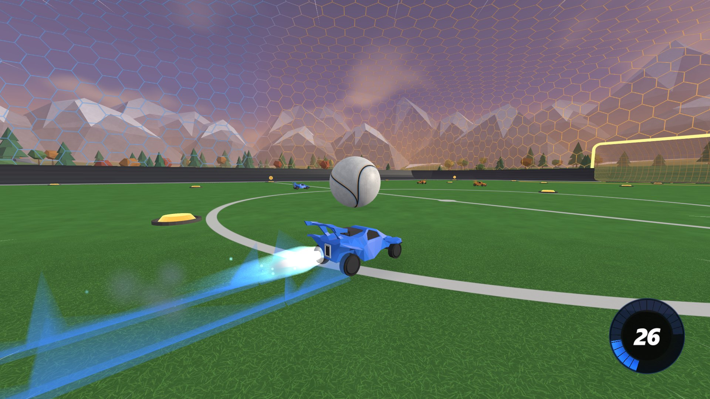
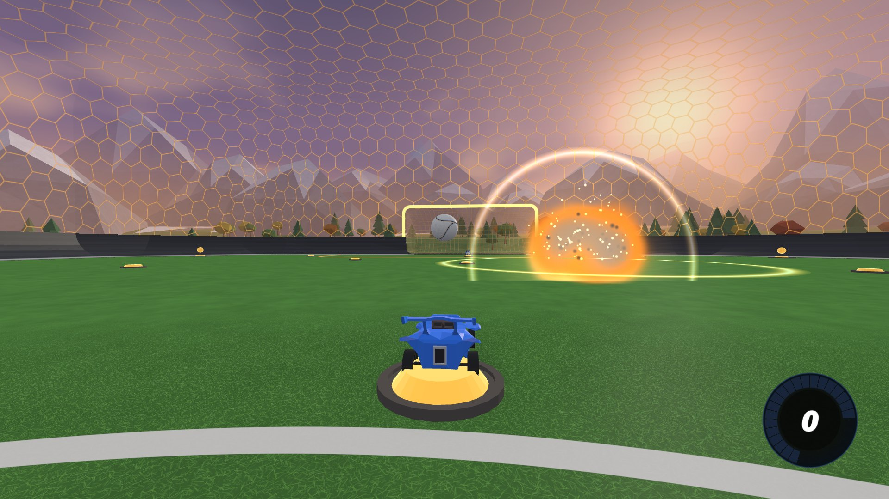
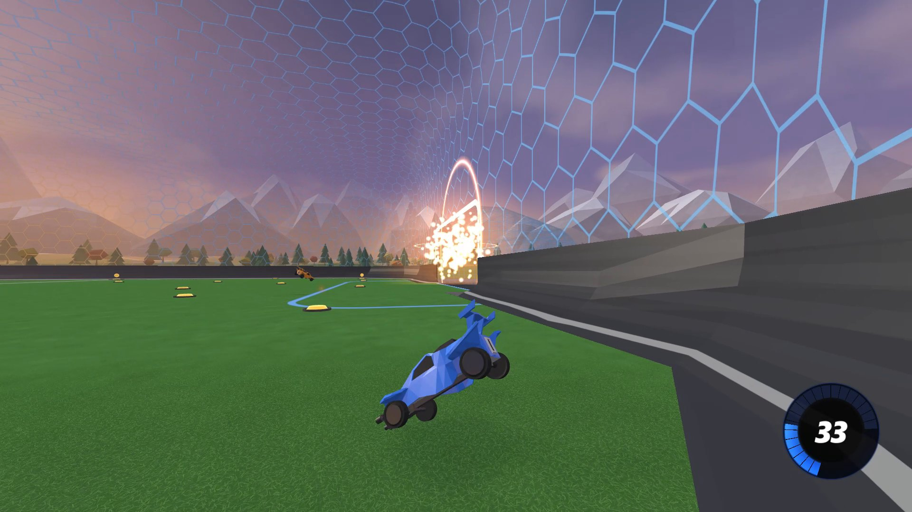
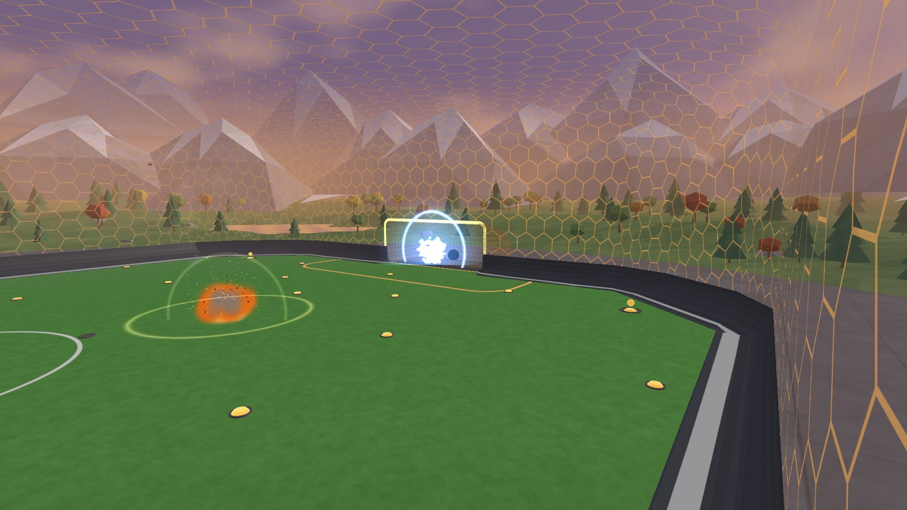

# BeautifulSim

A Rocket League-style 3D visualizer for bots trained with [RocketSim](https://github.com/ZealanL/RocketSim)
(GigaLearnCPP, rlgym-sim / RLGym-PPO, or anything that can send JSON over UDP).

It's a fork of [RocketSimVis](https://github.com/ZealanL/RocketSimVis) by ZealanL with reworked visuals: your
training (or any other program) streams game states to it, and it renders them live in a stylized arena with
effects, a Rocket League-like camera, and a clip recorder. It never touches the simulation, it only watches.

This version ships **without sound and without any Rocket League game files**: every model and texture comes
from RocketSimVis or is generated procedurally.



| | |
|---|---|
|  |  |
|  | |

## Installation (Windows)

1. Install **Python 3.10+** and **git**.
2. Clone the repo and install the dependencies:
   ```bat
   git clone https://github.com/Nashh2678/BeautifulSim-NoAudio.git
   cd BeautifulSim-NoAudio
   pip install -r requirements.txt
   ```
3. Launch it: double-click **`RUN.bat`**, or run `python src\main.py` to see errors in a console.
   The first start takes a few extra seconds (the landscape mesh is generated once and cached).
4. Optional, for clips: install ffmpeg (`winget install Gyan.FFmpeg`) or point `RSV_FFMPEG` at an `ffmpeg.exe`.

## Sending it a game

The vis listens on **UDP 127.0.0.1:9273** and renders whatever game states it receives (an empty arena until then):

- **GigaLearnCPP**: use its render mode (the `RenderSender` + `python_scripts/render_receiver.py` pair sends to this port).
- **rlgym_sim / RLGym-PPO**: copy `rocketsimvis_rlgym_sim_client.py` next to your training script, then right after `env = rlgym_sim.make(...)`:
  ```py
  import rocketsimvis_rlgym_sim_client as rsv
  type(env).render = lambda self: rsv.send_state_to_rocketsimvis(self._prev_state)
  ```
- **Anything else**: send JSON in the format described in [networking-format.md](networking-format.md).
  The optional per-car fields (`has_flip`, `ball_touched`, `controls`) make jumps, flips, flip resets and touches exact;
  without them they are guessed from the motion.

Run several instances side by side with `RSV_PORT=<port>`.

## Controls

| key | action |
|---|---|
| Space | ball cam on/off |
| P | spectate the player closest to the ball |
| A | auto camera on/off (follows whoever is closest to the ball) |
| C | save a clip of the last 12 s (mp4, in `clips/`) |
| H | show/hide the top-left panel (Edit Settings: camera, graphics) |

**Graphics** (H → Edit Settings → Graphics, applied live): anti-aliasing (MSAA off/2x/4x/8x), resolution
(Balanced caps the 3D scene at 2.1 MP and upscales it: pick Native on a 1440p/4K screen if it looks soft, or
Supersampled for extra smoothness), distant detail, VSync, frame-rate cap. Camera settings mirror Rocket League's.

## Features

- **Arena**: see-through hexagon walls and ceiling, grass pitch with field markings and team-coloured goal boxes,
  translucent team nets, soft shadows, a low-poly valley with mountains, trees and a lake under an evening sky.
- **Cars and ball**: team-painted cars, a two-seam ball, boost pads that fade back in while recharging.
- **Effects**: boost flames, supersonic trails, jump flashes, flip-reset indicator, demolition explosions,
  goal bursts, boost pad pickups, and a boost gauge.
- **Game events** reconstructed from the state stream: jumps, double jumps, flips (including wall dashes),
  flip resets (only when the reset is really taken on the ball), ball touches, bounces, bumps, demos and goals.
- **Smooth playback**: incoming states go through a small jitter buffer, so uneven packet timing from a busy
  trainer doesn't show as stutter.
- **Clips**: C saves the last 12 s by re-rendering them offscreen at 1080p60 (NVIDIA NVENC when available),
  so recording never slows the live view.

## Credits

- [ZealanL](https://github.com/ZealanL): [RocketSimVis](https://github.com/ZealanL/RocketSimVis), the visualizer this is built on,
  including its car, ball, arena and boost pad models; and [RocketSim](https://github.com/ZealanL/RocketSim).
- Rocket League is a trademark of Psyonix. This project is not affiliated with or endorsed by Psyonix or Epic Games.
